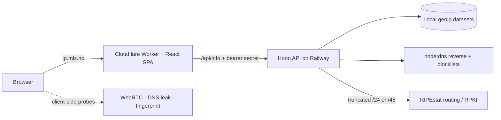

# Architecture

`ip-speil` is a **Bun-workspaces monorepo** with two independently deployed
targets and a shared type package. `apps/web` is the public site — a React 19
SPA served by a Cloudflare Worker at `ip.mlz.no` — which proxies `/api/info` to
`apps/api`, a Hono server on Railway at `api.ip.mlz.no`, attaching a shared
bearer secret so the browser never sees it. `packages/shared` is the type-only
wire contract (`@ip-speil/shared`) imported by both apps so the shapes can't
drift apart. Geolocation is resolved entirely from local DB-IP/iptoasn
datasets baked into the API image at build time — the visitor's IP is never
sent to a third party for it; the one enrichment that does reach a third party
(RIPEstat routing/RPKI) sends only a truncated `/24` or `/48` network block.



Day-to-day working conventions (commands, local dev, coding conventions) live
in [CLAUDE.md](CLAUDE.md). This file is the reference: the file tree, the
routes, and why a handful of non-obvious decisions were made.

## Layout

```text
apps/
  api/                 Railway backend (Hono on Bun; no build step)
    src/
      index.ts         Entry — parses PORT, reads PROXY_SECRET, starts/stops Bun.serve
      app.ts           Hono app factory: resolves options, wires middleware + routes
      auth.ts          requireProxySecret middleware (constant-time Bearer check)
      config.ts        Typed config: timeouts, cache TTLs, rate limits, upstream URL
      security.ts      secureHeaders middleware (API headers; no page CSP — that's web)
      rate-limit.ts    In-memory fixed-window limiter (Hono middleware)
      routes/
        health.ts      GET /health
        info.ts        GET /api/info
      lib/
        client-ip.ts   getClientIp / isProbablyIp / isUnroutableIp
        ip-lookup.ts   Resolves IpInfo entirely from the local geoip datasets (zero
                       outbound requests carrying the visitor IP); re-exports IpInfo
                       from @ip-speil/shared. Optional off-by-default ipapi.is online
                       tiebreaker (ENABLE_ONLINE_TIEBREAKER)
        ip-service.ts  cache + single-flight + enrichment pipeline over getIpInfo
        enrich.ts      composes reverse DNS + blocklists + local geo cross-check +
                       RIPEstat routing
        geo-sources.ts cross-checks two LOCAL datasets (DB-IP city vs iptoasn ASN
                       country) — no network
        reputation.ts  reverse DNS (PTR) + DNS blocklist lookups via node:dns
        routing.ts     RIPEstat routing/RPKI/abuse-contact lookup, keyed and cached by
                       a truncated network block (see config.ts RIPESTAT)
        tor.ts         Tor bulk exit list (public, no visitor IP sent), refreshed
                       hourly, in-memory membership check
        log.ts         Structured leveled logger (LOG_LEVEL); never logs a visitor IP
        cache.ts       TtlCache + single-flight + createCachedFetcher
        fetch.ts       FetchLike type + fetchJson helper
      geoip/
        parse.ts       Pure parsers: iptoasn TSV + DB-IP City Lite CSV -> columnar,
                       string-interned arrays
        binary.ts      Compact binary (de)serialization for the built geoip tables
        store.ts       GeoDb — sorted range tables + interned strings, binary-searched
                       lookup
        load.ts        Reads the pre-built binary tables at boot; missing dataset ->
                       null, never throws
    scripts/
      fetch-datasets.ts  Build-time fetcher: downloads iptoasn + DB-IP City Lite,
                         parses, and bakes them into apps/api/data/ as binary tables.
                         Runs in the Docker build, not at runtime
    data/                Pre-built geoip binary tables (gitignored; baked at Docker
                         build time by fetch-datasets.ts)
    test/              Bun tests: app routes (+ proxy-secret), cache, geo, routing, IP
                       handling
    tsconfig.json      Strict API typecheck (noUncheckedIndexedAccess; types ["bun"])
    Dockerfile         oven/bun single-stage; built from REPO ROOT context, runs non-root
  web/                 Cloudflare Worker + React SPA (Vite + Tailwind v4)
    index.html         Vite entry (root); mounts #root, loads /src/main.tsx as module
    vite.config.ts     react + tailwindcss + cloudflare plugins; assetsDir "bundle"
    src/
      main.tsx         Bundle entry: pre-paint theme, <ThemeProvider>, createRoot(<App/>)
      App.tsx          Page shape: header · hero · readout band · ruled sheet · footer
      index.css        Tailwind v4 entry: imports the DS (tokens + self-hosted fonts + base) + thin token bridge
      vite-env.d.ts    Vite client types + ambient non-standard browser API augments
      worker/
        index.ts       Front door: routes dynamic paths, falls through to ASSETS.fetch
        cli.ts         Content-negotiated plain-IP responses (`curl ip.mlz.no`, /ip)
        proxy.ts       proxyInfo — forwards /api/info to API_ORIGIN w/ Bearer PROXY_SECRET
        headers.ts     echoHeaders — /api/headers (minus hop-by-hop/sensitive)
        umami.ts       umamiScript (/script.js) + umamiSend (POST /api/send) proxies
        tsconfig.json  Worker typecheck (types ["@cloudflare/workers-types"])
      api.ts           Wrappers over the site's /api/* endpoints
      report.ts        Redacted, copyable diagnostics report
      types.ts         Client data shapes; re-exports wire types from @ip-speil/shared
      hooks/           useScan (collect + render one scan), useFlash
      components/
        SiteHeader.tsx   Sticky bar: mark, scan actions (≥lg), <ThemeToggle iconOnly/>
        Hero.tsx         h1 + click-to-copy IP (target hugs the address, affordance
                         on the rule) + the annotation row: MarginNote left,
                         <Verdict> right + IPv4/IPv6 toggle
        Verdict.tsx      The page's conclusion, set opposite the note in the hero
        ExposureBand.tsx The five headline readings as a <Readout>; snap-scrolls <720px
        Section.tsx      <SectionHeading> + body — one section of the sheet
        Readouts.tsx     "The full readout": the four reference readouts (routing,
                         WebRTC, fingerprint, headers) in one <Accordion>
                         (title · what it found · chevron)
        MobileActions.tsx Sticky icon-only action bar (<lg)
        actions.ts       PageActions — the scan-action interface shared by
                         SiteHeader and MobileActions
        primitives.tsx   Dot, Finding, KV/KVList (ledger), Columns/halves, Absent,
                         Footnote, Mono, Button, Skel, …
        Footer.tsx       One-line colophon + required DB-IP attribution
        sections/        Facts (NetworkFacts — exits + operator; GeoFacts), Privacy
                         (the FindingList of leak checks), Browser, Fingerprint,
                         Headers, WebRTC, Routing, Diff/Shared
      probes/          network (IPv4/IPv6/DoH), webrtc, fingerprint, dns-leak, dnssec
      lib/             cx, icons, format, hash, theme (pre-paint apply), heuristics
                       (leak verdict, entropy), exposure (+ bandItems), diff,
                       snapshot, client-hints, glossary (Tip + the term dictionary)
                       (+ *.test.ts, run by `bun test`)
    scripts/
      gen-brand-assets.ts  Renders the brand-asset set (favicons, app icons, OG/
                           Twitter cards) from the "mirror mark" via headless
                           Chromium at 2× DPI. Run: `bun run --filter @ip-speil/web
                           gen:assets`. Fonts are the design system's own woff2.
    public/            Static root copied into dist/client, served by ASSETS
      robots.txt       Disallows /api/
      sitemap.xml      Referenced from robots.txt
      site.webmanifest PWA manifest, linked from index.html
      _headers         Cloudflare security headers + page CSP + font caching
      favicon.ico      Packed 16+32 icon (generated)
      assets/
        icons/         favicon.svg (source of truth) + PNG/maskable app icons (generated)
        social/        og.png + twitter-card.png — 1200×630 share cards (generated)
    tsconfig.json      Client typecheck (jsx react-jsx; excludes worker + *.test.ts)
    wrangler.jsonc     Worker config: main, assets (run_worker_first), vars (API_ORIGIN…)
    dist/              Vite build output (gitignored): client/ + Worker bundle
packages/
  shared/
    src/index.ts       Canonical wire types: IpInfo, GeoSource, GeoCrossCheck,
                       RoutingInfo, RpkiInfo, RpkiRoa, HeaderMap
    package.json       @ip-speil/shared; exports "." → ./src/index.ts
    tsconfig.json      Type-only package typecheck
tsconfig.base.json     Shared compiler options; each workspace tsconfig extends it
biome.json             Lint + format config (covers apps/** + packages/**)
railway.json           Railway deploy config (Dockerfile builder → apps/api/Dockerfile)
.github/workflows/ci.yml   Runs `bun run check` on push/PR
```

## Routes

### API (`apps/api`, wired in `src/app.ts`) — Railway, `api.ip.mlz.no`

- `GET /api/info?ip=` — IP geolocation resolved **entirely from local DB-IP/iptoasn
  datasets** baked into the image at build time (zero outbound requests carrying the
  visitor IP); an online tiebreaker (ipapi.is) exists but is off by default
  (`ENABLE_ONLINE_TIEBREAKER`). **Enriched** with reverse DNS, DNS-blocklist hits, a
  local two-dataset country cross-check, Tor exit-list membership, and RIPEstat
  routing/RPKI/abuse-contact context (queried by a truncated `/24` or `/48` network
  block, never the exact IP — see `lib/routing.ts`). Cached (TTL + single-flight).
  Rate limited per-IP with a cross-IP backstop; rejects a syntactically invalid `ip`
  with 400. **Gated by `requireProxySecret`** — requires `Authorization: Bearer
  <PROXY_SECRET>` (returns 401 otherwise), so only our Worker can reach it. The
  rate-limit key is the real client IP, read from the `X-Forwarded-For` the Worker
  sets from `CF-Connecting-IP`.
- `GET /health` — returns `ok` (Railway healthcheck). Not gated.

### Web (`apps/web/src/worker/index.ts`) — Cloudflare, `ip.mlz.no`

The Worker runs first only for the paths in `run_worker_first`; everything else is a
static asset (`env.ASSETS.fetch`).

- `GET /` → content-negotiated: terminals (curl/wget/…) get the bare IP as plain
  text (`cli.ts`), browsers get the SPA (`env.ASSETS.fetch`).
- `GET /ip` → bare public IP as plain text. `GET /json` → same as `/api/info`.
- `GET /api/info?ip=` → **proxied** to `${API_ORIGIN}/api/info`, with the bearer
  secret attached at the edge and the client IP forwarded via `X-Forwarded-For`.
- `GET /api/headers` → echoes request headers (minus hop-by-hop/sensitive ones).
  Note: these are **Cloudflare-flavored** headers (what a site behind Cloudflare
  sees), not the raw browser socket.
- `GET /script.js` → first-party proxy of the Umami tracker script (edge-cached).
- `POST /api/send` → first-party proxy that forwards Umami events (else 405).
- `GET /robots.txt`, `/assets/*`, hashed `/bundle/*`, … → static from `dist/client/`.

## Design decisions & gotchas

- **In-memory, single-replica (API).** The cache and rate-limiter live in the API
  process memory — correct for one Railway replica; scaling horizontally
  would fragment them. Revisit before adding replicas.
- **Docker build context is the repo root.** `railway.json` points at
  `apps/api/Dockerfile`, but the build must run from the repo root so it can copy the
  root manifests + workspace `package.json`s + `packages/shared`. `.dockerignore`
  excludes `apps/web` and tests from the API image.
- **Header-echo is Cloudflare-flavored.** `/api/headers` runs in the Worker, so it
  reflects the request as Cloudflare presents it, not the raw browser TCP socket.
- **TLS/JA3/JA4 fingerprinting was evaluated and dropped:** the only free service
  (tls.peet.ws) sends no CORS header, so the browser can't read it, and proxying it
  server-side would fingerprint our server rather than the visitor.
- **The "Connection security" section (TLS/ECH/WARP via `1.1.1.1/cdn-cgi/trace`) was
  removed for the same reason:** Cloudflare now returns 503 to cross-origin
  `fetch`/`XHR` requests against that endpoint (confirmed live — a plain navigation to
  the same URL still returns 200), and proxying it server-side would report the
  Worker's handshake with Cloudflare, not the visitor's browser.
- **DNS-leak (bash.ws) is best-effort** — it's wrapped in timeouts and degrades to the
  DoH-reachability note if the provider is unreachable.
- **Most of the console noise on prod is the probes working, not bugs.** A cross-origin
  `fetch` that fails is logged by the browser itself and cannot be caught away in JS,
  so a healthy scan still prints `ERR_NAME_NOT_RESOLVED` for `ipv6.icanhazip.com` (no
  IPv6 on this network), for `www.brokendnssec.net` (the resolver refused the
  deliberately-broken signature — that *is* the "DNSSEC validated" result), and for the
  four `N.<id>.bash.ws` labels (the DNS query is the signal; the connection is meant to
  fail). Don't "fix" these by deleting the checks.
- **Cloudflare injects two scripts the page CSP then blocks.** Both are zone features
  applied *after* the Worker responds, so nothing in this repo can strip them — they
  have to be turned off in the Cloudflare dashboard:
  **Web Analytics** automatic setup injects `static.cloudflareinsights.com/beacon.min.js`
  (blocked by `script-src 'self'`, and redundant — we proxy Umami first-party), and
  **Security → Bots → JavaScript Detections** injects an inline `__CF$cv$params`
  bootstrap for `/cdn-cgi/challenge-platform/…` (blocked by the same directive). Each
  one costs a console error on every page load, and neither ever runs. Loosening the
  CSP to admit them is the wrong direction: this is a privacy diagnostic that ships no
  third-party script.
