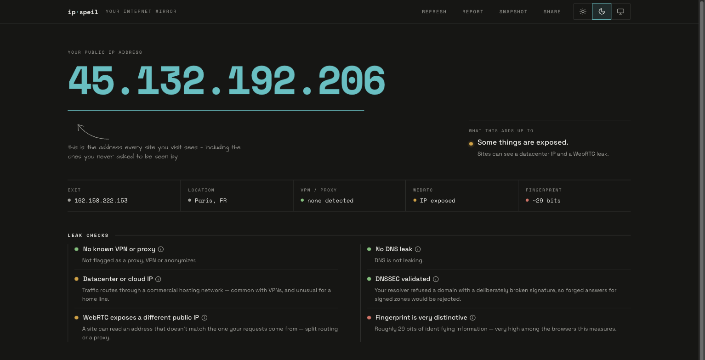
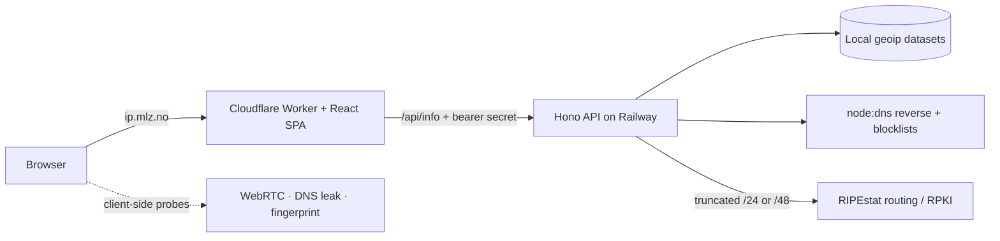

# ip-speil

A privacy mirror that shows what a website can infer about your connection the moment you load it.

[](https://github.com/martinzachariassen/ip-speil/actions/workflows/ci.yml)
[](https://scorecard.dev/viewer/?uri=github.com/martinzachariassen/ip-speil)
[](LICENSE)

**Status:** Live in production · Bun ≥ 1.3 · MIT



**[Try it live → ip.mlz.no](https://ip.mlz.no)** — no install required. *Speil* is Norwegian for *mirror*.

## What it does

- Runs about a dozen privacy and network checks on demand and shows the raw findings next to a plain-language verdict: public IP, geolocation, ISP/ASN, reverse DNS, VPN/proxy/Tor and abuse-blocklist signals, WebRTC and DNS leaks, DNSSEC enforcement, IPv6/dual-stack routing, BGP/RPKI, a browser fingerprint with an entropy estimate, storage surfaces, and the HTTP headers your browser sends.
- **Never sends your IP to a third party for geolocation.** Location, ISP, and ASN are resolved from local DB-IP-style datasets on the server and cross-checked between two of them. The one enrichment that reaches an external service — RIPEstat routing/RPKI — receives only a truncated `/24` or `/48` network block, never your exact address.
- **Fingerprinting runs in your browser and never leaves the device.** Canvas, audio, WebGL, fonts, and device signals are computed client-side; only a coarse entropy estimate reaches the copyable report.
- **Honest verdicts, not scare-ware.** A WebRTC "leak" that is only your VPN's own IP is not flagged; a DNS resolver exiting a different country is.
- **Stores nothing** — no database, no request logs, no cookies, no ad trackers (analytics are cookieless Umami, proxied first-party). It is a diagnostic mirror, not a VPN or a "fix your privacy" product.

## Quickstart

```bash
git clone https://github.com/martinzachariassen/ip-speil.git
cd ip-speil
mise install                                      # installs the pinned Bun
bun install
cp apps/web/.dev.vars.example apps/web/.dev.vars  # point the Worker at the local API
bun run dev                                       # API on :3000, web on :5173
# → open http://localhost:5173
```

## Usage

Open the site in a browser and it scans automatically. It also answers terminals:

```bash
curl ip.mlz.no       # your public IP, plain text
curl ip.mlz.no/json  # full JSON: geo, ASN, VPN/Tor flags, blocklists, routing
```

## Architecture

Split deployment, one repo — a Bun-workspaces monorepo with two deploy targets and a shared type package:

- **`apps/web`** — the public site: a React 19 SPA (Vite + Tailwind v4) served by a Cloudflare Worker at `ip.mlz.no`. The Worker owns the dynamic edge routes and proxies `/api/info` to the API, attaching a shared bearer secret so the browser never sees it.
- **`apps/api`** — a Hono server on Bun (no build step), deployed to Railway at `api.ip.mlz.no`. It does the enrichment — local geoip lookup, reverse DNS + blocklists via `node:dns`, RIPEstat routing — behind a cache + single-flight guard. `/api/info` is reachable only with the bearer secret.
- **`packages/shared`** — `@ip-speil/shared`, the type-only wire contract imported by both apps so they can't drift.



Details: [ARCHITECTURE.md](ARCHITECTURE.md). Day-to-day working conventions: [CLAUDE.md](CLAUDE.md).

## Configuration

Runtime environment variables. Tunables — cache TTLs, rate limits, RIPEstat prefix lengths — are typed constants in [`apps/api/src/config.ts`](apps/api/src/config.ts), not env vars.

| Variable | Where | Default | Purpose |
|---|---|---|---|
| `PROXY_SECRET` | API + Worker | *(required in prod)* | Shared bearer secret gating `/api/info`. The API refuses to boot without it in production; unset in dev leaves the gate a no-op. |
| `API_ORIGIN` | Worker | `https://api.ip.mlz.no` | Upstream the Worker proxies `/api/info` to. Set to `http://localhost:3000` in `apps/web/.dev.vars` for local dev. |
| `PORT` | API | `3000` | Port the API listens on. |
| `LOG_LEVEL` | API | `info` | API log verbosity. |
| `UMAMI_SCRIPT_URL` / `UMAMI_SEND_URL` | Worker | Umami cloud | First-party-proxied analytics endpoints. |

The page CSP and browser security headers live in [`apps/web/public/_headers`](apps/web/public/_headers); add any new external origin to `connect-src` there or the browser blocks the fetch.

## Development

Run from the repo root — Bun fans each command out to the right workspace.

| Command | What it does |
|---|---|
| `bun run dev` | API (`:3000`) + web dev server (`:5173`) together |
| `bun run build` | `vite build` → `apps/web/dist/` (React client + Worker bundle) |
| `bun run typecheck` | `tsc --noEmit` across every workspace |
| `bun run lint` / `bun run format` | Biome check / write |
| `bun test` | Bun's test runner (API routes + client `lib/` logic) |
| `bun run check` | build + typecheck + lint + tests — run before finishing |

Local preview needs `apps/web/.dev.vars` (copied from `.dev.vars.example`) so the Worker proxies to your local API instead of production. Optionally run `bun apps/api/scripts/fetch-datasets.ts` to populate the local geoip datasets so `/api/info` returns full data instead of the limited fallback.

## Deployment

Two targets, deployed independently from `main` — a web-only change won't redeploy the API, and vice versa.

- **Web → Cloudflare Workers.** [`deploy-web.yml`](.github/workflows/deploy-web.yml) runs `wrangler deploy`; `wrangler.jsonc` reconciles the `ip.mlz.no` custom domain and keeps the `*.workers.dev` URLs off. Needs `CLOUDFLARE_API_TOKEN` and `CLOUDFLARE_ACCOUNT_ID`.
- **API → Railway.** [`deploy-api.yml`](.github/workflows/deploy-api.yml) runs `railway up` (Docker build from the repo root per [`railway.json`](railway.json), healthcheck on `/health`). Needs `RAILWAY_TOKEN` and `RAILWAY_SERVICE`.

Set `PROXY_SECRET` on both sides in production (`wrangler secret put PROXY_SECRET`; a matching Railway env var). Roll back by redeploying the previous version from each provider.

> [!NOTE]
> The API's cache and rate limiter live in process memory — correct for one Railway
> replica. Scaling horizontally would fragment them; move that state to a shared store
> before adding replicas.

## Contributing

Personal project. Issues and PRs welcome — run `bun run check` before opening one.

## License

[MIT](LICENSE) © [Martin Zachariassen](https://mlz.no)
